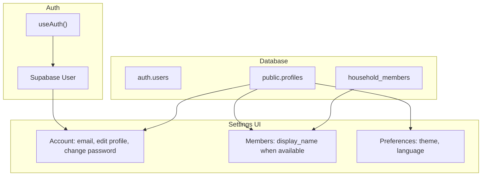

# User settings page – plan (profiles + preferences + mobile)

## Goals (from requirements)

- **Table for user preferences** and **user info** (name, etc.) in the DB.
- **Change password** section in settings.
- **Edit profile** section (name and other profile fields).
- **Members section** shows **user names when available** (from profiles).
- **Mobile-friendly**: works well on small screens and touch.

---

## Current state (brief)

- **Identity:** Supabase `auth.users` only; no `profiles` table. Refs: `supabase/migrations/20250130000001_households_and_storage.sql`, `src/hooks/useAuth.ts`.
- **Settings UI:** `src/components/SettingsPanel.tsx` — slide-over panel (300px / 85vw), household, members (user_id + role, no names), theme/language in localStorage, sign out.
- **Theme/Language:** `src/theme/ThemeContext.tsx`, `src/i18n/LanguageContext.tsx` — localStorage only.

---

## 1. Database: profiles table (user info + preferences)

**Single table** `public.profiles` for profile info and preferences (one RLS surface, one place to extend).

**Suggested columns:**

- `id` — `uuid` PK, references `auth.users(id) on delete cascade` (one row per user)
- `display_name` — `text` (name shown in members list and activity)
- `avatar_url` — `text` optional (profile picture URL)
- `theme` — `text` (`'light' | 'dark' | 'system'` — sync with ThemeContext)
- `language` — `text` (`'en' | 'es'` — sync with LanguageContext)

Add more profile fields later (e.g. phone, timezone) in the same table if needed.

**RLS:**

- **SELECT:** User can read own profile; user can also read profiles of users who share at least one household (so members list and activity feed can show display names). Policy: `id = auth.uid() OR id IN (SELECT user_id FROM public.household_members WHERE household_id IN (SELECT public.user_household_ids()))`.
- **INSERT:** Only for own row (`id = auth.uid()`), e.g. on first sign-in.
- **UPDATE:** Only own row (`id = auth.uid()`).

**Trigger:** On `auth.users` insert, insert a row into `public.profiles(id)` with defaults (or create profile on first app load via upsert if you prefer not to touch auth schema).

**Migration:** New file under `supabase/migrations/` (e.g. `YYYYMMDD_profiles.sql`): create table, RLS policies, trigger.

---

## 2. App types and data layer

- **Types** in `src/types.ts`: Add `Profile` interface matching the table (`id`, `display_name`, `avatar_url`, `theme`, `language`). Keep re-exporting Supabase `User`, `Session`.
- **Hook** `useProfile(userId)`: Fetches `profiles` for `userId`; returns `{ profile, updateProfile, loading }`. `updateProfile(partial)` does `update(...).eq('id', userId)`.
- **Theme/Language sync:** When profile exists, read initial value from profile and persist changes to both localStorage and `profiles` so preferences follow the user across devices. Fallback to localStorage when profile is missing or loading.

---

## 3. Settings UI sections (order and behavior)

Keep the existing slide-over panel; ensure content works on **mobile** (see section 5).

1. **Account (current user)**
   - Show email from `useAuth().user.email` (read-only).
   - **Edit profile:** Inline form or small sheet: `display_name`, optionally `avatar_url` (upload or URL). Save via `updateProfile({ display_name, avatar_url })`.
   - **Change password:** Subsection with current password + new password + confirm. Call `supabase.auth.updateUser({ password: newPassword })`. Supabase may require re-auth; show clear success/error messages.
2. **Household**
   - Unchanged: name, id, **Members**, invite code, switch household.
   - **Members:** For each row from `household_members`, fetch display name from `profiles` (query by member `user_id`s). Display: **display_name when available, else email if you add it later, else truncated user_id**. Show "(You)" next to current user. Keep role badge (owner/member).
3. **Preferences**
   - Theme and Language: persist to both localStorage and `profiles` when logged in. Read initial value from profile when loaded.
4. **Manage locations** (unchanged).
5. **Sign out** (unchanged).

---

## 4. Members section: showing user names

- **Data:** After loading `household_members`, query `profiles` with `.in('id', memberUserIds)`. RLS allows reading because those users share the household.
- **Display:** For each member: `profile?.display_name ?? email ?? user_id.slice(0, 12)`. Primary improvement is **display name when set**.
- **Activity feed:** When rendering `actor_id`, use profile (or cached profiles) to show `display_name` when available (e.g. in `src/components/ActivityFeed.tsx`).

---

## 5. Mobile-friendly settings

- **Touch targets:** Buttons and controls at least **44px** height (current theme/lang buttons are 36px — consider increasing on small screens). Verify new buttons (Save profile, Change password submit) meet this.
- **Panel width:** Already `max-width: 85vw`; on very small screens consider **full width** (e.g. `width: 100%` below 480px) so it feels like a full-screen sheet.
- **Scrolling:** Panel is `overflow-y: auto`; keep single scrollable column. Ensure forms (change password, edit profile) are in scrollable area so keyboard does not cover inputs.
- **No hover-only actions:** All actions tap/click (current design already respects this).
- **Edit profile / Change password:** Prefer **inline expand or bottom sheet** for forms on mobile so the form is large enough and scrollable. Reuse existing panel section styles.

---

## 6. Implementation order (suggested)

1. **Migration:** Create `public.profiles` with RLS and trigger (or app-side upsert on first load).
2. **Types + useProfile:** Add `Profile` type and `useProfile(userId)` with `updateProfile`.
3. **Theme/Language sync:** Read/write theme and language to profile when present; keep localStorage as cache/fallback.
4. **Settings – Account:** Add Account section with edit profile form and change-password form; wire to `useProfile` and `supabase.auth.updateUser`.
5. **Settings – Members:** Load profiles for member `user_id`s; show display name when available.
6. **Mobile:** Adjust CSS (min heights, full-width panel on small screens, scrollable forms).

---

## Summary diagram

- **public.profiles** is the source for user info (name, avatar) and preferences (theme, language). Members and Activity feed read display names from profiles; Account reads/writes current user profile and triggers change password via Supabase Auth.
